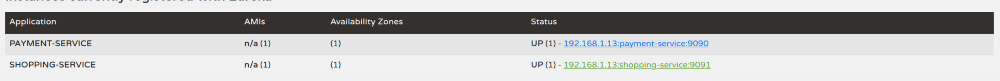

### Why eureka

the concept of eureka-server and eureka-client is to have an efficient contact among microservices.
These microservices are called as eureka-clients and there is a central eureka-server which maintains connection to all clients. 

All clients are registered to the server, and the server directs calls among clients.

In brief

Microservice-1 : name - payment-service  localhost: 9091
Microservice-2 : name - shopping-service localhost: 9090

if we are not using eureka-server-client architecture we will have to do following, for example: microservice-1 to microservice-2 like <localhost:9090>/path...

to avoid this hardcoding we register this in eureka-server as 
 
 
 after which a service can access other simply by service-name , instead of host;port
 
like http://payment-service/path..
