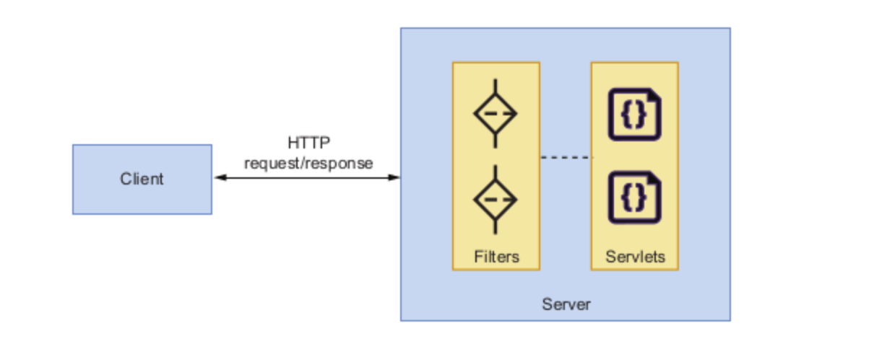
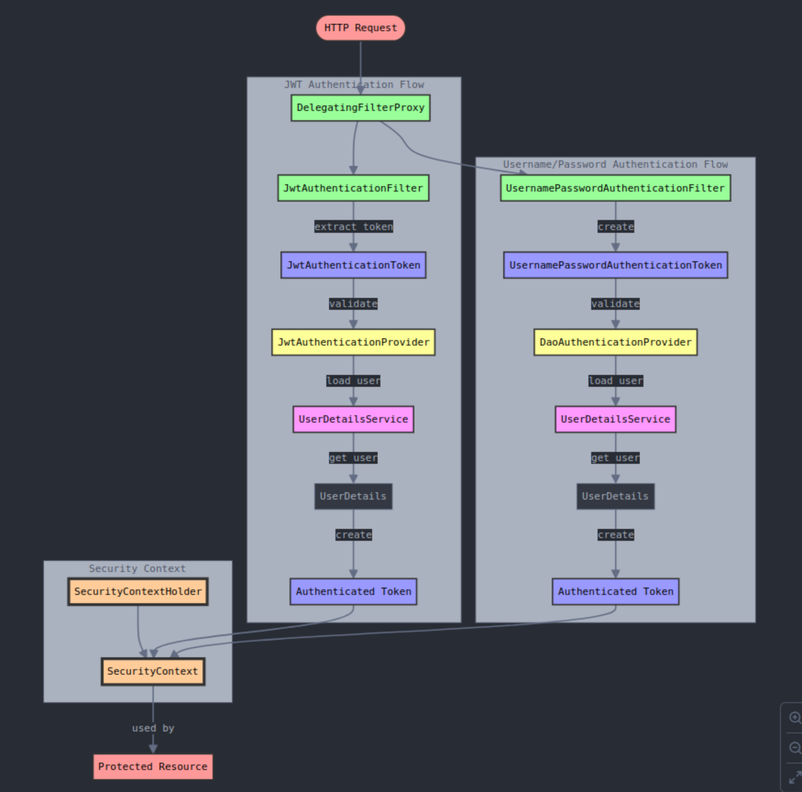

### Filters

- In Spring, the DispatcherServlet is the main servlet, which handles all incoming requests to the application.
- A filter sits before a Servlet and intercepts the
request–response. It has the ability to modify the request–response objects. One or more filters can be configured through a FilterChain, and all filters that are part of the chain can intercept and modify the request–response objects.



- Depending upon the authentication that spring uses - that specific filter is invoked. Like UsernamePasswordAuthentication for when user uses username/password or Basic-AuthenticationFilter when using basic http spring authentication.

Spring Authentication
- Delegating Filter proxy receives the authentication request.
- it passes on the authentication request to the filter chain.
- These filter chains are maintained by Spring, we can add or remove filters , also adjust their order.
- filter chain - declares the authentication manager which gives us the authentication provider we query to authenticate the user.
- While logging in - we take the authentication provider from the authentication manager and call authenticate method in the provider. 
- The result of this method is set as SecurityContextHolder.getContext().setAuthentication(authentication) - which is the current user.



Filter - Chain
    ^       ^
    |       |
This authentication provider has to be configured in the auth manager method in spring security configuration class.
    ^       ^
    |       |
Authentication Provider - like DaoAuthenticationProvider or JwtAuthenticationProvider
    - UserDetailsService object 
    ^       ^
    |       |
This user has to be formed/returned from the method loadUserByUsername in a class which is implements UserDetailsService 
    ^       ^
    |       |
The user that we return/or create - is an implementation of the class UserDetails


Session management
- stateless
- never
- always

OAuth authentication
- different types to implement OAuth2. 
  - Authorization code grant
    - Client app redirects user to the Authorization server.
      - The request includes the client ID, redirect URI, requested scopes, and a state parameter for CSRF protection.
      -     ```json
            GET /authorize?response_type=code&client_id=CLIENT_ID&redirect_uri=REDIRECT_URI&scope=SCOPES&state=STATE
            ``` 
    - User logs in, authorization server gives the authorization code.
      - Authorization response:
      -     ```json
            HTTP/1.1 302 Found
            Location: REDIRECT_URI?code=AUTHORIZATION_CODE&state=STATE
            ```
    - User uses the authorization code to query authorization server for access token.
    - Authorization server grants access token after verifying the credentials.
      - ```json
            {
            "access_token": "ACCESS_TOKEN",
            "token_type": "Bearer",
            "expires_in": 3600,
            "refresh_token": "REFRESH_TOKEN"
            }
        ```
    - User sends the access token to the resource server.

+--------+                               +-------------------+
|        |--(A)- Authorization Request ->|   Authorization   |
|        |                               |       Server      |
|        |<-(B)-- Authorization Code ----|                   |
|        |                               |                   |
|        |                               |                   |
|        |--(C)-- Authorization Code --->|                   |
| Client |                               |                   |
|        |<-(D)----- Access Token -------|                   |
|        |                               +-------------------+
|        |                               |                   |
|        |--(E)----- Access Token ------>|                   |
|        |                               |   Resource Server |
|        |<-(F)--- Protected Resource ---|                   |
+--------+                               +-------------------+


#### State
- state helps in csrf protection. Even if any attacker gets hold of the state, he cannot use to it make request to the authorization server.
- the state is created dynamically, by the user session, this is passed on to the authorization server and then authorization server returns it when user is authenticated.
- when the state is returned from the authorization server, we match it to the local state and only proceed if matches.
- Even if the attacker gets hold of the state, he cannot match it to the local state as he would have to get a hold of the user session.
- redirect_uri : registered redirect uris.
- scope : permissions

Implicit grant techique
- step (A) is same, but after logging in to the server the user directly gets hold of the access token (E).

+--------+                               +-------------------+
|        |--(A)- Authorization Request ->|   Authorization   |
|        |                               |       Server      |
|        |<-(B)---- Access Token --------|                   |
|        |                               +-------------------+
|        |                               |                   |
|        |--(C)----- Access Token ------>|                   |
| Client |                               |                   |
|        |<-(D)--- Protected Resource ---|                   |
+--------+                               +-------------------+


- Disadvantages:
- Access Token Exposure: The access token is returned in the URL fragment, which is accessible to the user agent (e.g., web browser). This makes it more susceptible to interception by malicious scripts or browser extensions.
- no refresh tokens - short lived tokens.