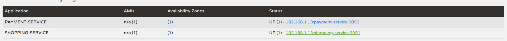
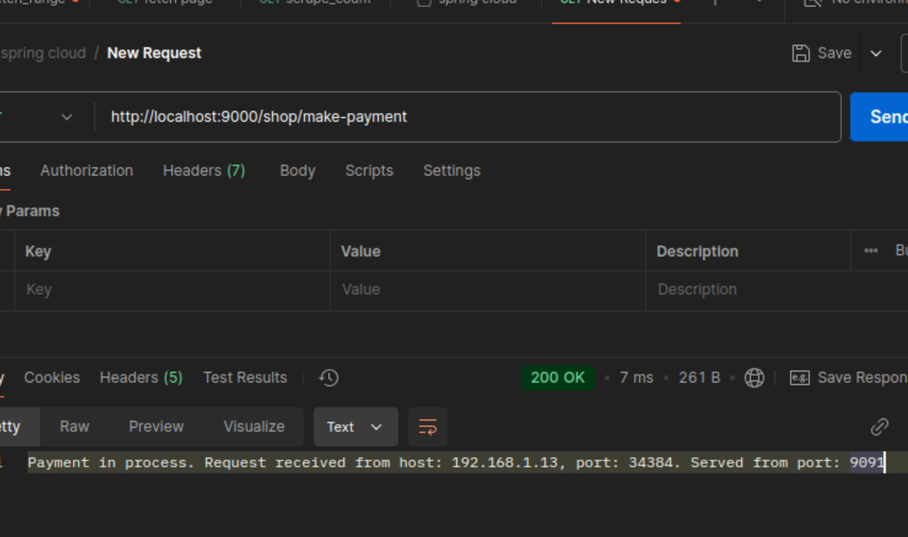
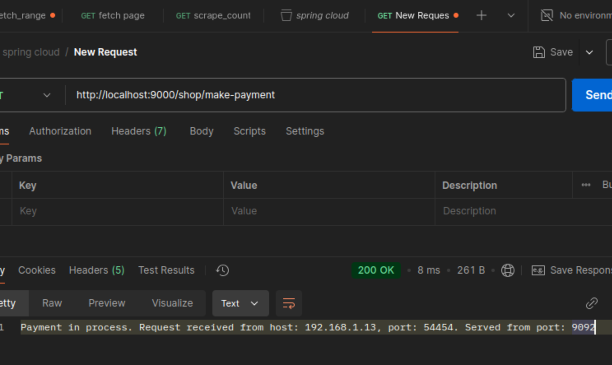
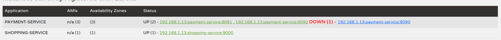
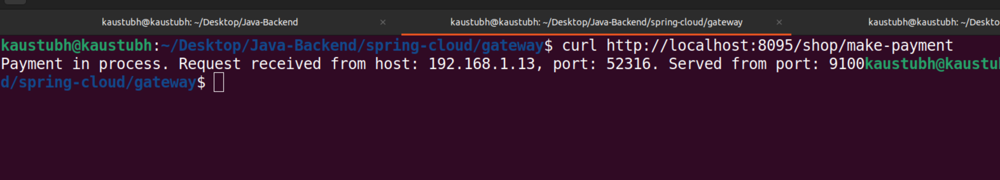

### Why eureka

the concept of eureka-server and eureka-client is to have an efficient contact among microservices.
These microservices are called as eureka-clients and there is a central eureka-server which maintains connection to all clients. 

All clients are registered to the server, and the server directs calls among clients.

In brief

Microservice-1 : name - payment-service  localhost: 9091
Microservice-2 : name - shopping-service localhost: 9090

if we are not using eureka-server-client architecture we will have to do following, for example: microservice-1 to microservice-2 like <localhost:9090>/path...

to avoid this hardcoding we register this in eureka-server as 
 
 
 after which a service can access other simply by service-name , instead of host;port
 
like http://payment-service/path..

Adding load balancing by ribbon - client side load balancing (round robin by default).


 


### For now going with Spring Cloud gateway 

```xml
        <dependency>
			<groupId>org.springframework.cloud</groupId>
			<artifactId>spring-cloud-starter-gateway</artifactId>
		</dependency>
```
```properties
    spring.application.name=gateway
    server.port=8095
    spring.cloud.consul.host=127.0.0.1
    spring.cloud.consul.port=8500
    spring.cloud.gateway.discovery.locater.enabled=true
    spring.cloud.gateway.discovery.locater.lower-case-service-id:true
```


### To-do: Consul
- In eureka we see that we have to create a new server separately for the eureka server.
- also we have to manually register or unregister the clients.
- A better solution would be to use Spring Consul.

- Downloading the consul binary from Hashicorp 

```
wget -O - https://apt.releases.hashicorp.com/gpg | sudo gpg --dearmor -o /usr/share/keyrings/hashicorp-archive-keyring.gpg
echo "deb [arch=$(dpkg --print-architecture) signed-by=/usr/share/keyrings/hashicorp-archive-keyring.gpg] https://apt.releases.hashicorp.com $(lsb_release -cs) main" | 
sudo tee /etc/apt/sources.list.d/hashicorp.list
sudo apt update && sudo apt install consul
```

Making necessary configuration changes:
- After adding the consul-discovery client in pom.xml, 
- Adding @EnableDiscoveryClient to the spring boot application, 
- Configuring application.properties to point to location of consul service.
    ```
    # Spring Cloud Consul Configuration
    spring.cloud.consul.host=127.0.0.1
    spring.cloud.consul.port=8500
    spring.cloud.consul.discovery.service-name=shopping-service
    ```

(Got stuck below,)
when doing inter-process communication using restTemplate, as follows:
```
    @GetMapping("/make-payment")
    public String invokePaymentService() {
        String url = "http://payment-service/pay/initiate";
        return restTemplate.getForObject(url, String.class);
    }
```
<strong>
here, the restTemplate bean should be marked as @LoadBalanced. This tells the spring boot to intercept this request before it hits the DNS and it diverts it towards the consul and fetches necessary client information.
</strong>

Now further more, to add an API gateway, we have a few options. 
We can add the spring cloud gateway but for that we will have to spin up a separate server.

We can have Zuul but that is very spring related.
To have a language agnostic gateway we will install Kong.

Kong is built on top of nginx server and that is the reason we see this . 


Role of reverse proxy web server (Nginx) and service mesh (Consul)

- Nginx is primarily a web server that excels at handling high-concurrency situations. Think of it as a highly efficient traffic coordinator for your web applications. 
- When requests come to your system, Nginx can serve static content directly and route dynamic requests to appropriate application servers.
- In a microservices context, Nginx often acts as a reverse proxy and load balancer. 
- Imagine you're directing traffic at a busy intersection - Nginx is like a skilled traffic officer who can: 
  - Route incoming requests to the appropriate service (like directing cars to different streets)
  - Balance load across multiple instances of the same service (distributing traffic evenly across lanes)
  - Handle SSL termination (checking vehicles' credentials before they enter restricted areas)
  - Cache responses (setting up express lanes for common routes)
  
- Consul, on the other hand, serves a different but complementary purpose. It's a service mesh solution that provides several crucial capabilities for distributed systems:
    - Service Discovery: Imagine you're in a large organization where teams and offices frequently move around. Consul acts like a dynamic directory that always knows where every service is located. When Payment Service needs to talk to Auth Service, it asks Consul for the current location rather than hardcoding addresses.
    - Configuration Management: Consul can store and distribute configuration settings across your entire system. It's like having a central bulletin board where any service can look up its current configuration, and changes can be propagated instantly.
    - Health Checking: Consul regularly checks if services are healthy, similar to a doctor performing routine health checkups. If a service instance becomes unhealthy, Consul ensures it doesn't receive traffic.
Here's a simple example of how you might register a service with Consul: